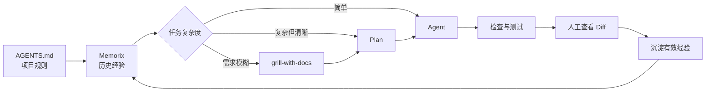

title: 个人 AI 轻量级编程方案
author: Believe firmly
tags:
  - 笔记
  - linux
categories: []
date: 2026-08-02 09:28:00
---
> ps：太久没更新了未来估计也不会写博客了这个时代网上和ai找信息就行确实不想折腾了摆烂时代开始了，人人都是天才程序员。希望大家token够用用不陨落！掰掰

最近用了这套ai工作流做了一个[Payload-RDL](https://github.com/myxiaoshen/payload-RDL)学习项目，感觉还是很爽写着没啥压力（应该是太简单了对ai没啥压力吧QAQ）可以给大家参考。成品如图随便截几张。

<!--more-->


那么就进入今天的正题，现在文章我都是AI润色过的了哈哈，看个乐子吧。

## 前言：为什么我没有选择重型 SDD

随着 AI 编程普及，OpenSpec、Spec Kit 等 SDD（规范驱动开发）方案越来越多。它们的思路没问题：先明确需求、边界和方案，再让 AI 写代码。

对于多人协作、大型项目或需要审计的工程，这类流程很有价值。但对个人开发者来说，如果修一个 Bug、改一个页面，也要维护 Proposal、Specs、Design 和 Tasks，开发很容易变成“维护流程”。

而且，文档越多，不代表 AI 理解得越好。重复、过期或与当前任务无关的内容，反而会稀释重点并浪费 Token，而且模型上下文有限制一个任务开一个会话，避免模型拥堵造成额外成本与时间。

所以，我更倾向于一套轻量组合：

- 用 `AGENTS.md` 管稳定规则；
- 用 Memorix 记录踩坑经验；
- 用 Copilot Plan 先规划，再让 Agent 执行；（这里大家根据常用的编程工具组合就好CC和Codex很火，笔者只是用惯了微软这一套东西并且cp有较多资源）
- 需求复杂时，再按需使用 `grill-with-docs`。



## 一、AGENTS.md：给 AI 一份项目说明书

我把 `AGENTS.md` 理解成“写给 AI 看的 README”。

README 告诉人如何认识和运行项目；`AGENTS.md` 则告诉 AI：代码放在哪里、架构边界是什么、哪些文件不能动、修改后要运行哪些检查。

AGENTS较为通用的生成指令的示例如下可以参考：

```md
请分析当前代码仓库，并在仓库根目录创建或精简 `AGENTS.md`。

目标不是编写完整的项目说明书，而是生成一份轻量、高密度、长期稳定的 AI 编程指令，使后续 AI Agent 能快速把握项目方向，同时尽量减少上下文占用。

## 核心原则

- 分析可以深入，写入必须克制。
- 只记录会实际影响 AI 编程决策的内容。
- 以项目真实文件、配置、代码和 CI 为依据，不得猜测。
- 能从代码或配置中立即看出的内容，不必重复记录。
- README 中已有的详细说明只提供路径，不要复制。
- 不写通用编程常识或空泛的“最佳实践”。
- 不记录容易过期的统计信息和实现细节。
- 不写入密码、Token、连接字符串、租户信息或其他敏感数据。
- 本次任务只创建或修改 `AGENTS.md`，不得修改其他文件。
- 如果已有 `AGENTS.md`，删除冗余、失效、重复和无法验证的规则，保留有效约束。

## 第一步：静默分析项目

优先检查：

- `README.md`、贡献指南和文档入口
- 包管理器、项目文件、解决方案文件和锁文件
- 构建、测试、Lint、格式化和类型检查配置
- CI/CD 工作流
- 应用入口和主要源码目录
- 代表性的业务模块及对应测试
- 数据库迁移、生成代码、部署和基础设施目录
- 已有的 AI 指令文件

忽略：

- `.git/`
- `node_modules/`
- `dist/`
- `build/`
- `bin/`
- `obj/`
- `coverage/`
- 缓存、构建产物、依赖目录和大型二进制文件

需要从项目中确认：

1. 项目用途和类型；
2. 核心技术栈及包管理器；
3. 主要目录及职责；
4. 架构边界和依赖方向；
5. 真实可用的开发、构建和验证命令；
6. 项目特有且稳定的编码约定；
7. 禁止修改、自动生成或操作风险较高的区域；
8. 不同类型改动所需的最低验证方式。

不要把分析过程、完整文件清单或完整依赖列表写入 `AGENTS.md`。

## 第二步：判断一条信息是否值得写入

写入前逐条检查：

- 它是否会改变 AI 的修改方式？
- 它是否适用于多数开发任务？
- 它是否无法从当前文件附近快速获知？
- 它是否可能避免架构、安全、构建或测试错误？
- 它是否在未来一段时间内保持稳定？

只有大部分答案为“是”时才写入。

## 第三步：生成轻量化 AGENTS.md

优先控制在 80～150 行以内。

小型项目尽量不超过 80 行；复杂项目可以适当增加，但不要为了完整而堆积内容。

建议结构如下；没有有效内容的章节直接省略：

# AGENTS.md

## Project

用 2～4 行说明项目用途、项目类型及核心技术栈。

## Repository Map

只列出主要目录及职责，不要展开完整目录树。

## Commands

只保留 AI 最常使用的真实命令：

- 安装依赖
- 本地开发
- 构建
- 测试
- Lint、格式或类型检查

如果命令必须在特定目录运行，应明确注明。

## Architecture and Conventions

仅记录项目特有的核心规则，例如：

- 模块职责和依赖方向
- 新功能通常放在哪里
- 项目统一的 API、错误处理或数据访问模式
- 必须沿用的现有组件、封装或基础设施
- 测试文件的组织方式

优先使用短句和明确指令。

## Boundaries

明确列出：

- 不得手工修改的生成文件
- 不得随意改动的旧系统或第三方目录
- 不得提交的敏感配置
- 需要人工批准的数据库、部署、云资源或破坏性操作

## Validation

根据改动范围说明最低验证要求。

要求 AI：

1. 修改前阅读目标模块及附近测试；
2. 优先进行最小范围修改；
3. 不重构无关代码；
4. 不随意增加生产依赖；
5. 行为发生变化时同步更新相关测试；
6. 完成后运行与改动相关的最小验证集；
7. 报告已执行和未执行的验证。

## References

仅在确有需要时列出详细文档路径，例如：

- 架构说明：`docs/architecture.md`
- 开发环境：`docs/development.md`

不要复制这些文档的正文。

## 具体写作要求

- 使用项目主要文档语言；无法判断时使用中文。
- 路径和命令使用反引号。
- 每条规则尽量控制在一到两行。
- 使用“必须”“不得”“优先”等明确措辞。
- 避免背景故事和长篇解释。
- 不重复同一规则。
- 不列出完整依赖版本。
- 不描述每个源码文件。
- 不加入无法从仓库验证的内容。
- 不执行部署、发布、生产迁移、数据删除或云资源修改。
- 不把这份 Prompt 或分析步骤写入 `AGENTS.md`。

## 完成后检查

生成后重新审查 `AGENTS.md`：

1. 删除不影响 AI 决策的内容；
2. 删除可直接从配置中轻易看出的冗余内容；
3. 删除与 README 重复的大段说明；
4. 删除空泛、重复、过时或无法验证的规则；
5. 检查命令和路径是否真实存在；
6. 检查是否包含敏感信息；
7. 确保读完后能回答：
   - 这是一个什么项目？
   - 主要代码在哪里？
   - 应该遵循什么架构方向？
   - 哪些地方不能动？
   - 修改后如何验证？

完成后，只需在对话中简要报告：

- 创建或精简了哪个文件；
- AGENTS.md 的行数；
- 保留了哪些核心方向；
- 哪些内容因不确定而没有写入；
- 是否建议某个子项目拥有独立的 `AGENTS.md`。

```