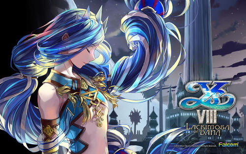

title: 伊苏
tags:
  - 娱乐
categories: []
author: ''
date: 2020-03-01 16:41:00
---
伊苏系类从初1就接触了，陪伴到了我上大学爷青回~唯美而又轻松的画风让人放松，加上冒险的剧情与游戏精密的装备设定让游戏更加具有发掘性，挑战boss的刺激画面和音乐的切入都很震撼人心，我最喜欢的单机游戏没有之一！
伊苏6，7，起源，誓约都给人一种热血冒险的感觉。现在伊苏8新作也上市咯，开始冒险之旅吧！伊苏天下第一！破音~~~~

 <!-- more -->
建议玩游戏的顺序：6，F，0，7（这个系列是画质的大转折本人不是很喜欢这部），树海，8，9。伊苏系类难度并不高（嗑药嗑药O(∩_∩)O），但我个人建议还是直接上困难难度可以体验更好的打击快感和彩蛋，单纯玩玩娱乐可以直接走普通难度。
下面是伊苏部分系类的op贼炫酷，op涉及小剧透喔但是并不影响体验。
#### 伊苏6：纳比斯汀的方舟（入坑作）
<iframe src="//player.bilibili.com/player.html?aid=3527979&bvid=BV1us411R7hs&cid=5615414&page=5" scrolling="no" border="0" frameborder="no" framespacing="0" allowfullscreen="true"width="100%" height="500px"> </iframe>

#### 伊苏F：菲尔盖娜之誓约
<iframe src="//player.bilibili.com/player.html?aid=3527979&bvid=BV1us411R7hs&cid=5615412&page=3" scrolling="no" border="0" frameborder="no"  width="100%" height="500px"framespacing="0" allowfullscreen="true"> </iframe>
#### 伊苏O ：起源
<iframe src="//player.bilibili.com/player.html?aid=3527979&bvid=BV1us411R7hs&cid=5615415&page=6" scrolling="no" border="0" frameborder="no" framespacing="0" allowfullscreen="true" width="100%" height="500px"> </iframe>
#### 伊苏7
<iframe src="//player.bilibili.com/player.html?aid=3527979&bvid=BV1us411R7hs&cid=5615416&page=7" scrolling="no" border="0" frameborder="no" framespacing="0" allowfullscreen="true" width="100%" height="500px"> </iframe>
#### 伊苏：塞尔塞塔的树海
<iframe src="//player.bilibili.com/player.html?aid=3527979&bvid=BV1us411R7hs&cid=5615418&page=9" scrolling="no" border="0" frameborder="no" framespacing="0" allowfullscreen="true" width="100%" height="500px"> </iframe>
#### 伊苏8：达娜的安魂曲（个人认为最棒的一部）
<iframe src="//player.bilibili.com/player.html?aid=3527979&bvid=BV1us411R7hs&cid=11945565&page=10" scrolling="no" border="0" frameborder="no" framespacing="0" allowfullscreen="true" width="100%" height="500px"> </iframe>
#### 伊苏9 ：怪人之夜
这里代没有op喔，本作接续亚特鲁从结束阿尔塔戈公国的五大龙事件之后，与多奇一起旅行到格里亚‧艾尔特林根，经过罗门帝国与星刻骑士团的联合管辖地，别名「监狱都市」的巴尔铎克。由于迦南大漩涡与赛尔赛塔事件的影响，亚特鲁被星刻骑士团以莫须有的罪名逮捕入狱，而罗门帝国派出的奇迹调查官(当时则被认为是审讯官)在审问的过程中告知亚特鲁，他将在几天后被送入罗门帝国王都内，帝国将对他进行更深度的审问与调查。
亚特鲁等到了一个机会，用暗藏的叉子将牢房开锁后进行逃狱，正当他濒临穷途末路之时，一位左手为炼金术义肢、右手持着奇特枪械，名叫「亚普莉莉丝」的神秘女性赫然现身，对着亚特鲁射出一发名为「怪人化」的特殊子弹。这时，亚特鲁的身体开始变异，获得了「异常的力量」，他使用获得的「异能（gift）」逃出生天，却被告知「若身上的怪人化诅咒没有完全解除，会永远被困在这座监狱都市」，而要解开这个诅咒，答案却深藏在这座监狱都市「巴尔铎克」之中……
